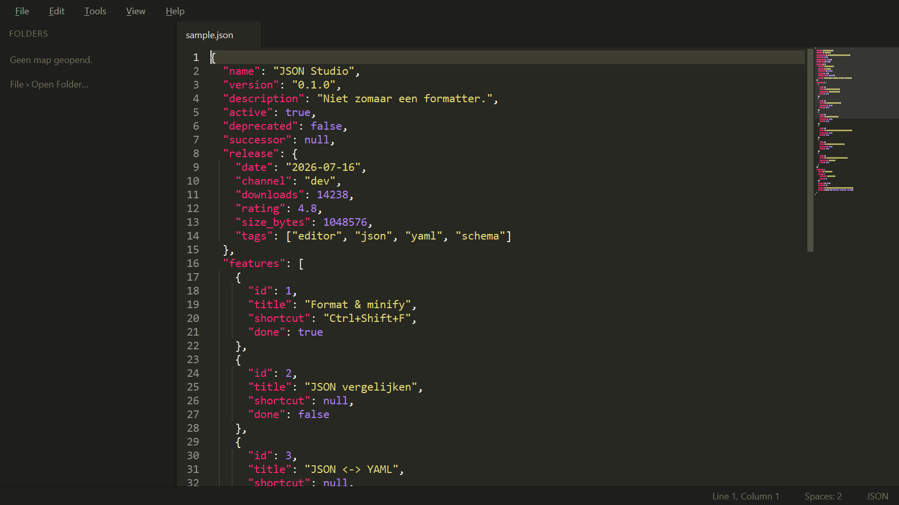

<div align="center">



<br>

[](https://github.com/203812/JSON-Studio/releases/latest)
[](https://github.com/203812/JSON-Studio/releases)
[](https://github.com/203812/JSON-Studio/actions)


**Een JSON-editor die eruitziet en aanvoelt als Sublime Text.**<br>
Openen, opmaken, controleren, omzetten — zonder gedoe. Voor Windows, macOS en Linux.

### [⬇️  Download JSON Studio](https://github.com/203812/JSON-Studio/releases/latest)

</div>

<br>

<div align="center">
  
</div>

<br>

## Wat is het?

JSON Studio opent je JSON-bestanden in een strakke, donkere editor en helpt je er
meteen mee aan de slag. Rommelige JSON netjes maken, controleren of hij klopt,
omzetten naar YAML — het kost één klik of één sneltoets. Handig of je nu
ontwikkelaar bent of gewoon even een JSON-bestand moet openen en fatsoenlijk wilt
kunnen lezen.

Geen installatie nodig: uitpakken en starten.

## Functies

- 🎨 **Mooie editor** — Monokai-thema, kleuren voor JSON én YAML, minimap, tabbladen en een zijbalk
- 🧹 **Opmaken & inkorten** — rommelige JSON in één klik netjes, of juist compact
- ✅ **Controleren** — fouten worden aangewezen met regel- en kolomnummer
- 🔄 **JSON ↔ YAML** — heen en weer omzetten; je origineel blijft gewoon staan
- ⌘ **Commandopalet** — alles binnen handbereik met `Ctrl+Shift+P`
- 🔔 **Automatische updates** — de app laat het weten als er een nieuwe versie is
- 📦 **Portable** — één map, geen installatie, geen rommel op je systeem

### Binnenkort

JSON-bestanden vergelijken · code genereren (C# / Java / TypeScript) · JSON Schema
maken · zoeken in grote bestanden.

## Downloaden & starten

Ga naar de **[nieuwste release](https://github.com/203812/JSON-Studio/releases/latest)** en kies je systeem:

| Systeem | Bestand | Starten |
| --- | --- | --- |
| **Windows** | `JSON-Studio-windows-x64.zip` | Uitpakken → `JsonStudio.exe` |
| **macOS** | `JSON-Studio-macos.zip` | Uitpakken → `JSON Studio.app` (eerste keer: rechtsklik → Openen) |
| **Linux** | `JSON-Studio-linux-x86_64.AppImage` | Uitvoerbaar maken → dubbelklikken |

Geen installatie nodig — alles zit erin.

## Sneltoetsen

| Actie | Toets |
| --- | --- |
| Commandopalet | `Ctrl+Shift+P` |
| Opmaken | `Ctrl+Shift+F` |
| Inkorten | `Ctrl+Shift+M` |
| Controleren | `Ctrl+Shift+V` |
| Nieuw · Openen · Opslaan | `Ctrl+N` · `Ctrl+O` · `Ctrl+S` |
| Zijbalk aan/uit | `Ctrl+K, Ctrl+B` |

Omzetten naar YAML of JSON vind je onder **Tools** en in het commandopalet.

<details>
<summary><b>Zelf bouwen vanaf de broncode</b></summary>

<br>

C++20 · Qt 6 Widgets · CMake. Werkt op Windows, macOS en Linux. `nlohmann_json`
en `yaml-cpp` worden automatisch opgehaald als ze niet geïnstalleerd zijn, dus je
hebt alleen Qt 6 en een C++-compiler nodig.

```bash
cmake -S . -B build -G Ninja -DCMAKE_BUILD_TYPE=Release
cmake --build build
ctest --test-dir build --output-on-failure
```

**Windows met MSYS2** (het gemakkelijkst lokaal):

```powershell
winget install MSYS2.MSYS2
C:\msys64\usr\bin\bash.exe -lc "pacman -S --needed --noconfirm mingw-w64-x86_64-gcc mingw-w64-x86_64-cmake mingw-w64-x86_64-ninja mingw-w64-x86_64-qt6-base mingw-w64-x86_64-nlohmann-json mingw-w64-x86_64-yaml-cpp"
.\build.ps1 -Run
```

De officiële builds voor alle drie de systemen worden gemaakt met
[GitHub Actions](.github/workflows/build.yml).

</details>

<br>

<div align="center">
<sub>JSON Studio · gemaakt met veel { } en te veel koffie</sub>
</div>
